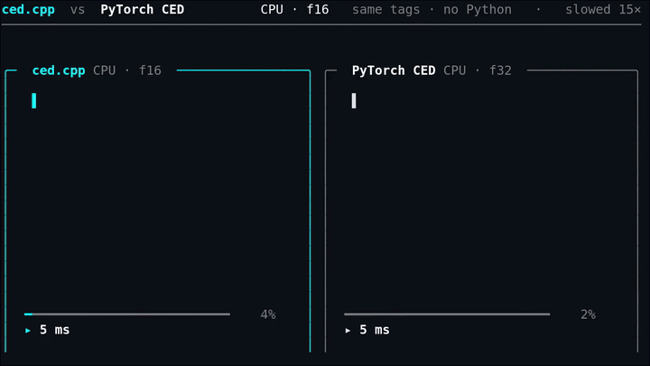
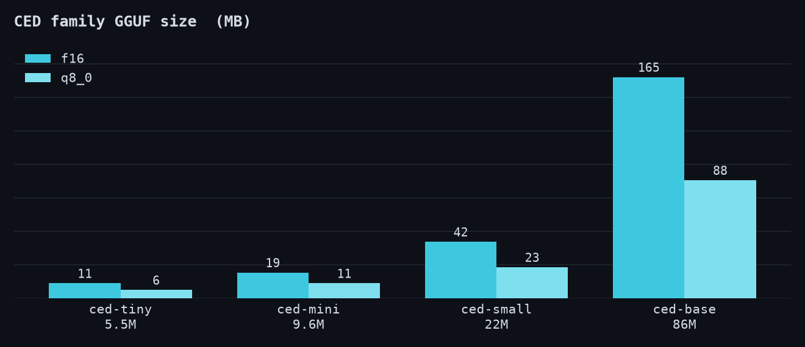
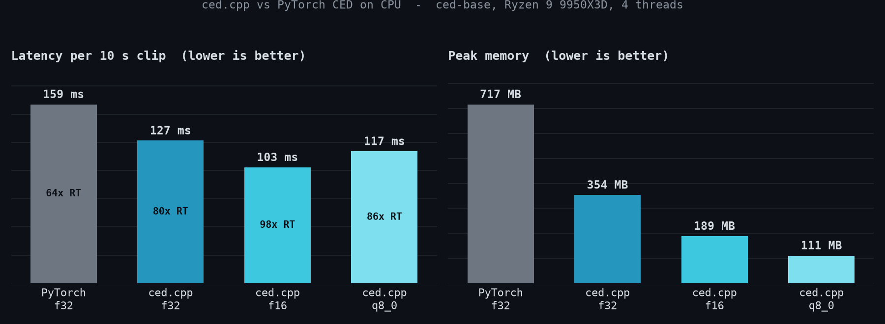

# ced.cpp

**Brought to you by the [LocalAI](https://github.com/mudler/LocalAI) team**, the folks behind LocalAI, the open-source AI engine that runs any model (LLMs, vision, voice, image, video) on any hardware, no GPU required.

[](https://huggingface.co/mudler/ced-gguf)
[](LICENSE)
[](https://github.com/mudler/LocalAI)

ced.cpp is a C++17 inference port of Xiaomi's **CED** ([Consistent Ensemble Distillation](https://github.com/RicherMans/CED)) audio-tagging models, built on [ggml](https://github.com/ggml-org/ggml). It tells you *what a sound is*: feed it any clip and it classifies the everyday sounds in it (baby cry, footsteps, dog bark, glass breaking, alarms, applause, speech, music, ...) into the 527-class [AudioSet](https://research.google.com/audioset/) ontology, on CPU (and on GPU through ggml's backends), with no Python runtime at inference time.

It covers the whole CED family (tiny / mini / small / base, 5.5M to 86M params), each **validated against the original PyTorch model end to end** (the C++ output is numerically equal to the reference, to ~1e-7 in f32). It runs **faster than PyTorch on CPU** while producing the same tags, and ships as small, self-contained GGUF files (f16, q8_0; base also f32) in a single collection repo, [mudler/ced-gguf](https://huggingface.co/mudler/ced-gguf). The smallest, `ced-tiny` at q8_0, is a **6 MB** file that runs comfortably on a Raspberry-Pi-class CPU.

It is wired into [LocalAI](https://github.com/mudler/LocalAI) as the `ced` backend: a REST endpoint (`POST /v1/audio/classification`) and **live recognition over the realtime websocket API**, so you can stream audio and get sound-event tags as they happen.

### See it run

The same clip fed to ced.cpp and to the original PyTorch CED, on the same CPU. Same tags, ced.cpp just gets there first, with no Python in the loop:



---

## Models

Every size is published as GGUF (f16, q8_0; base also f32) in the single collection repo [mudler/ced-gguf](https://huggingface.co/mudler/ced-gguf), and every one is validated end to end against the upstream `mispeech/ced-*` model. Convert any of them yourself with `scripts/convert_ced_to_gguf.py`.

| Model | Params | AudioSet mAP | f16 | q8_0 | Notes |
| ----- | ------ | ------------ | --- | ---- | ----- |
| [ced-tiny](https://huggingface.co/mispeech/ced-tiny)   | 5.5M | 48.1 | 11 MB | **6 MB**  | edge / Raspberry-Pi-class |
| [ced-mini](https://huggingface.co/mispeech/ced-mini)   | 9.6M | 49.0 | 19 MB | 11 MB | low-power |
| [ced-small](https://huggingface.co/mispeech/ced-small) | 22M  | 49.6 | 42 MB | 23 MB | balanced |
| [ced-base](https://huggingface.co/mispeech/ced-base)   | 86M  | 50.0 | 165 MB | 88 MB | accuracy default (also f32, 328 MB) |



CED is a plain AST/DeiT Vision Transformer over a log-mel spectrogram, which makes it a clean ggml port: no relative-position bias, no gated attention, no convolution stack. See [docs/ARCHITECTURE.md](docs/ARCHITECTURE.md).

The output is **multi-label**: each of the 527 classes gets an independent probability, so a clip can be "Speech" + "Music" + "Vehicle" at once. The full class list is embedded in every GGUF.

---

## Numerical parity

ced.cpp is checked against the *actual* upstream model, not a re-derivation: the reference tensors are dumped from `mispeech/ced-*` running in PyTorch (its own `modeling_ced.py` + torchaudio feature extractor), and the dump matches `model()` bit-for-bit. The C++ is then gated per component, then end to end.

| check | result |
| ----- | ------ |
| per-component (mel, init_bn, patch-embed, positional, 12 ViT blocks, head), ced-base | ≤ 2.3e-5 |
| **end-to-end probabilities, f32** | **1.7e-7** |
| end-to-end, all sizes (tiny / mini / small / base) | ≤ 2.4e-7 |
| f16 / q8_0 | 6.4e-5 / 6.0e-3 (identical top-5 tags) |
| diverse inputs (noise, near-silence, tones, chirp, short clips) via the C-API | ≤ 1.8e-5, top-1 matches |

The residual differences are f32 floating-point round-off (the mel FFT and the matmuls accumulate in a different order than PyTorch). Reproduce with `ctest` and `scripts/parity_diverse.py`.

---

## Performance

ced.cpp is faster than the PyTorch reference on CPU and uses a fraction of the memory, with the same tags. Numbers below: ced-base, a 10 s clip, AMD Ryzen 9 9950X3D, 4 threads (RTF is audio-seconds over processing-seconds, higher is faster). Full detail in [docs/BENCHMARKS.md](docs/BENCHMARKS.md).



| | latency / clip | realtime factor | peak RAM |
| --- | --- | --- | --- |
| PyTorch (`transformers` + `torchaudio`, f32) | 158.8 ms | 64x | 717 MB |
| **ced.cpp f32** (same precision) | **126.6 ms** | 80x | 354 MB |
| ced.cpp f16 | 102.9 ms | 98x | 189 MB |
| ced.cpp q8_0 | 117.1 ms | 86x | 111 MB |

Same precision (f32 vs f32), ced.cpp is **~1.25x faster and uses 2x less memory** than PyTorch. The near-lossless quantized configs you would actually ship go further: f16 is ~1.5x faster, and q8_0 drops to 111 MB (~6.5x less than PyTorch). There is also no multi-second `import torch` startup - `ced-cli` loads and classifies in well under a second.

Measure it yourself:

```sh
ced-cli bench models/ced-base-f16.gguf clip.wav --iters 40 --threads 4
python scripts/bench_torch.py --model mispeech/ced-base --wav clip.wav --iters 40 --threads 4
```

---

## Build

Clone with submodules (ggml is vendored at `third_party/ggml`):

```sh
git clone --recursive https://github.com/mudler/ced.cpp
cd ced.cpp
cmake -B build -DCED_BUILD_TESTS=ON && cmake --build build -j
```

Use `-DGGML_NATIVE=OFF` for portable or CI builds. For the shared library (LocalAI / dlopen), with ggml statically linked so the `.so` is self-contained:

```sh
cmake -B build-shared -DCED_SHARED=ON -DCED_BUILD_CLI=OFF \
  -DBUILD_SHARED_LIBS=OFF -DCMAKE_POSITION_INDEPENDENT_CODE=ON
cmake --build build-shared -j
# -> build-shared/libced.so
```

### CMake options

| Option              | Default | Purpose                                  |
| ------------------- | ------- | ---------------------------------------- |
| `CED_BUILD_TESTS`   | OFF     | Compile and register the parity ctests   |
| `CED_BUILD_CLI`     | ON      | Build `ced-cli`                          |
| `CED_SHARED`        | OFF     | Build libced as a shared library         |
| `CED_GGML_CUDA`     | OFF     | Forward GGML_CUDA to the submodule       |
| `CED_GGML_METAL`    | OFF     | Forward GGML_METAL to the submodule      |
| `CED_GGML_VULKAN`   | OFF     | Forward GGML_VULKAN to the submodule     |
| `CED_GGML_HIP`      | OFF     | Forward GGML_HIP (ROCm) to the submodule |

To build for a GPU backend, forward its flag, e.g. `cmake -B build -DCED_GGML_METAL=ON`.

---

## Running inference

```sh
# Top-k sound tags for a clip
ced-cli classify models/ced-base-f16.gguf clip.wav --top-k 5
#   0.93  Speech
#   0.60  Male speech, man speaking
#   0.51  Narration, monologue
#   ...

# Model metadata (arch, dims, mel params, class count)
ced-cli info models/ced-base-f16.gguf

# Benchmark (latency + realtime factor)
ced-cli bench models/ced-base-f16.gguf clip.wav --iters 40 --threads 4
```

Any WAV works: it is downmixed to mono and resampled to 16 kHz automatically. Clips longer than ~10 s are split into windows and averaged. The `ced-cli` binary lands at `build/examples/cli/ced-cli`.

---

## C-API (`libced.so`)

`include/ced_capi.h` is a flat, exception-free C-API meant for `dlopen` / FFI / LocalAI integration. Build the shared library with `-DCED_SHARED=ON`:

```c
#include "ced_capi.h"

ced_ctx *ctx = ced_capi_load("ced-base-f16.gguf");      // load ONCE
if (!ctx) { fprintf(stderr, "%s\n", ced_capi_last_error(NULL)); return 1; }

// mono float PCM in [-1,1]; resampled internally if sample_rate != model rate.
// Returns a malloc'd JSON array of the top-k tags (caller frees).
char *json = ced_capi_classify_pcm_json(ctx, pcm, n_samples, sample_rate, 5);
// [{"index":0,"score":0.93,"label":"Speech"}, ...]
if (json) { printf("%s\n", json); ced_capi_free_string(json); }

ced_capi_free(ctx);
```

The per-PCM entry points take an arbitrary mono window, so a realtime consumer can call them on a sliding buffer for live recognition. There is also a struct-array variant (`ced_capi_classify_pcm`) and a WAV-path variant (`ced_capi_classify_path_json`). See `include/ced_capi.h` for the full API.

---

## LocalAI

ced.cpp is the engine behind LocalAI's `ced` sound-classification backend. Once installed, classify over REST:

```sh
curl -F file=@clip.wav -F model=ced-base -F top_k=5 \
  http://localhost:8080/v1/audio/classification
# {"model":"ced-base","detections":[{"index":0,"label":"Speech","score":0.93}, ...]}
```

Or stream audio over the **realtime websocket API** for live recognition: configure a model with `pipeline.sound_detection: ced-base` and the server emits `conversation.item.sound_detection` events with scored tags as audio arrives, either on client-committed windows or on a server-side sliding window (`sound_detection_window_ms` / `_hop_ms`). Sound detection activates on *sounds*, not speech, so it runs without the voice VAD.

All four sizes are installable from the LocalAI model gallery.

---

## Python environment setup

Only needed for model conversion and validation, not for inference:

```sh
python3 -m venv .venv
.venv/bin/pip install torch torchaudio --index-url https://download.pytorch.org/whl/cpu
.venv/bin/pip install transformers gguf numpy soundfile
```

## Converting a model

```sh
# f16 (recommended), ~0.5x the size, near-lossless
.venv/bin/python scripts/convert_ced_to_gguf.py \
    --model mispeech/ced-base --output ced-base-f16.gguf --dtype f16

# q8_0, smallest, near-lossless
.venv/bin/python scripts/convert_ced_to_gguf.py \
    --model mispeech/ced-base --output ced-base-q8_0.gguf --dtype q8_0
```

Supported `--dtype`: `f32` (default), `f16`, `q8_0`. The GGUF is self-contained: all config, the 527 class labels, and the torchaudio mel filterbank + window are embedded, so no external files are shipped. Only the large linear `ggml_mul_mat` weights are quantized; conv, norm, positional, and bias tensors stay f32.

---

## Running tests

```sh
cmake -B build -DCED_BUILD_TESTS=ON && cmake --build build -j
ctest --test-dir build --output-on-failure
```

The tests are parity gates: each component and the end-to-end probabilities are compared against the PyTorch reference dumps (regenerate the fixtures with `scripts/gen_ced_baseline.py`). They cover the full ViT, the mel frontend, the short-clip path, and all three quantizations.

---

## Why ced.cpp

The CED checkpoints are great, but running them just for inference drags in a heavy Python/PyTorch + torchaudio stack. ced.cpp is a from-scratch C++17/ggml port focused purely on inference:

- **No Python at inference.** A single `libced.so` behind a flat C-API (`include/ced_capi.h`), easy to embed from C, C++, Go (purego), or Rust.
- **Numerically equal to the original**, validated end to end on every size.
- **Faster than PyTorch on CPU**, with a fraction of the memory.
- **Small and portable.** 6 MB to 165 MB GGUFs on CPU and any ggml GPU backend.
- **Built for realtime.** A window-friendly C-API powering live recognition in LocalAI.

---

## Citation

```bibtex
@software{ced_cpp,
  title  = {ced.cpp: a C++/ggml inference engine for CED audio tagging},
  author = {Di Giacinto, Ettore},
  url    = {https://github.com/mudler/ced.cpp},
  year   = {2026}
}
```

CED is by Xiaomi ([RicherMans/CED](https://github.com/RicherMans/CED)); the checkpoints are `mispeech/ced-*` on HuggingFace.

## Author

Ettore Di Giacinto ([@mudler](https://github.com/mudler)).

## License

ced.cpp is released under the [MIT License](LICENSE). The CED model **weights** redistributed as GGUF are Apache-2.0 (© Xiaomi Corporation); AudioSet labels are CC-BY-4.0. This project does not use the GPL-3.0 upstream training code: it is a clean-room reimplementation of the inference forward pass.
```
